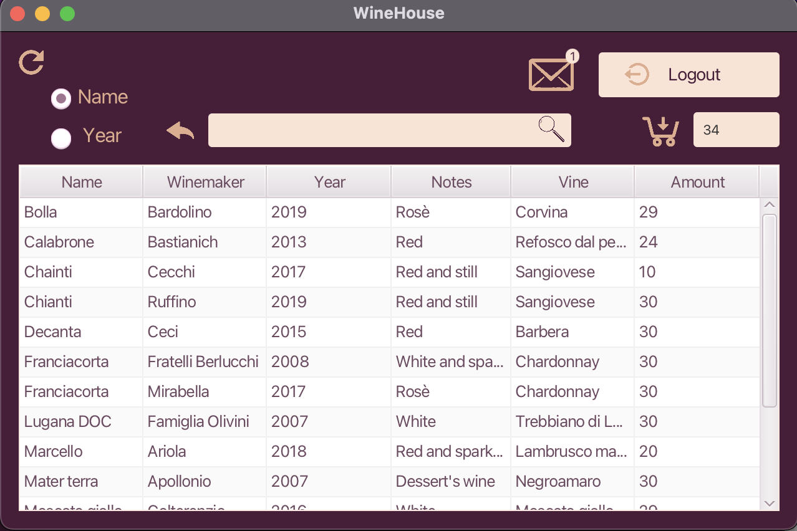

# WineHouse
Software for the management of a Wine House implemented using Java-FX.

## Requirements
- [Java](https://www.java.com/it/download/) 
- [Eclipse](https://www.eclipse.org/downloads/)
- [JavaFx](https://gluonhq.com/products/javafx/)
- [XAMPP](https://www.apachefriends.org/it/index.html)
- [MySQL connector](https://dev.mysql.com/downloads/connector/j/)

## Download and Setup of the projects
### Download WineHouse code
Clone the github repository
```
git clone https://github.com/giorgiatedaldi/WineHouse/
```

### Create Server Project
Create a new **JavaProject** and name it **WineHouseServer**. Copy the package **assegnamento** from the **WineHouseServer** folder downloaded from git and paste it into the project just created.

In the Eclipse **Package Explorer** right click on **WineHouseServer** project and select **Build Path** > **Add external archives** and select your **MySQL connector**.

### Create Client Project
Open Eclipse and go to **preferences** > **Java** > **Build Path** > **User Libraries** and press the **New** button and name it **JavaFX**.
Select the library you just created and click on **Add External JARs** and select all the .jar files from the directory where JavaFX library is saved.

Now open Eclipse's preferences and select **Java** > **Installed JREs**
Select the JRE version you are using and **duplicate** it. In the **JRE Definition** change the JRE name in **JRE+JavaFX** and in the **default VM arguments** past the following line on **Linux** or **Mac**:

```
--module-path /path/to/javafx-sdk-17/lib --add-modules javafx.controls,javafx.fxml
```
or this line for **Windows**

```
--module-path /Users/pragways/Documents/javafx-sdk-17.0.1/lib --add-modules javafx.controls,javafx.fxml
```

Click on **Add External JARs** and select all the .jar files from the /lib/ folder of the JavaFX folder, click **Open** and then **Finish**

Create a new **Java Project**, name it **WineHouseClient** and select **Use a project specific JRE** and select **Java+JavaFX**
You can know copy the package **assegnamento** from the **WineHouseClient** folder (downloaded from git) and paste it in the project you just created.


### Add run configurations
From Eclipse menu press **Run** > **Run configurations** and select the **new launch configuration** icon.
Select **WineHouseServer** project, name the configuration **Server** and, after pressing the **search** button, select **Server-assegnamento**.

From Eclipse menu press **Run** > **Run configurations** and select the **new launch configuration** icon.
Select **WineHouseClient** project, name the configuration **Client** and, after pressing the **search** button, select **Main-assegnamento**.

## Start WineHouse Demo
Open **XAMPP** control panel and start **MySQL database**.
You can now start the WineHouse demo by first starting the **Server** and then some **Clients**

